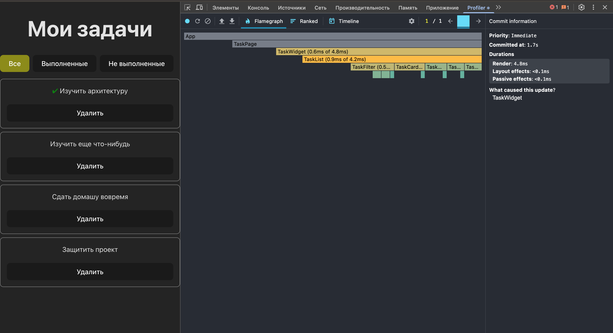
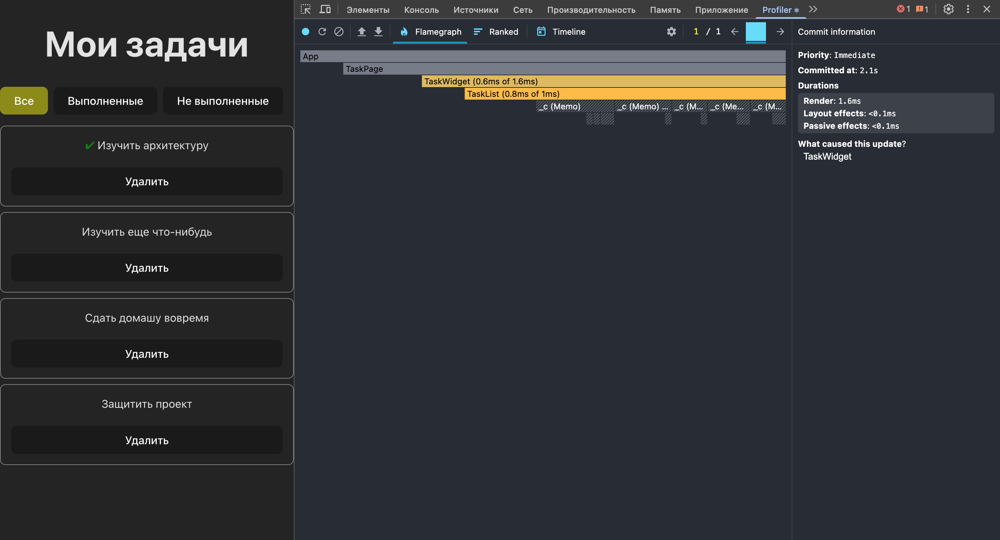
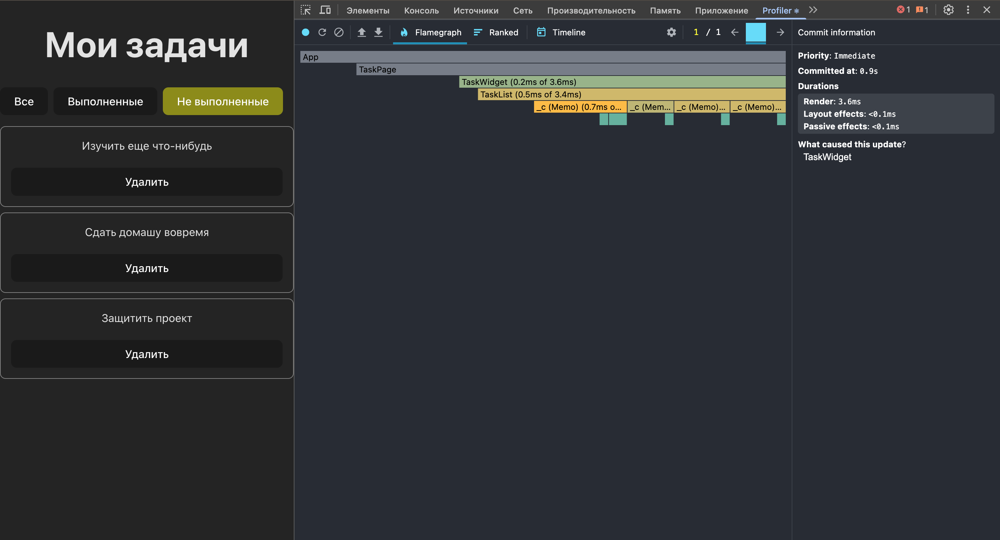

## Комментарии от прошлого ПР
1. Поправлена логика фильтрации
2. Добавлена мемоизация для фильтрации
3. Заглушка для кейса когда задачи отсутствуют

## Profiler

### Удаление задачи

До оптимизации профайлер выглядел таким образом. Здесь мы видим, что компонент фильтрации с кнопками и сами карточки перерисовываются.

После оптимизации мы видим, что когда удаляем задачу, то перерендер перестает срабатывать на фильтрации и на карточках задач.

### Фильтрация

Фильтрация работает одинаково с мемоизацией и без, потому что по клику на кнопку фильтрации меняется состояние и кнопки перерисовываются.
Карточки тоже перерисовываются потому что при смене состояния фильтра меняется весь список задач.

